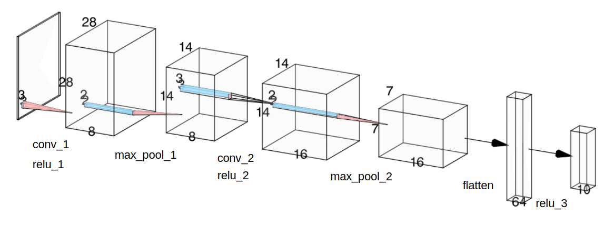

# CNN visualization
Convolution Neural Networks make sense through texts, but it's daunting to visualize how it works in our mind. By visualizing each step in CNN, it will give us some insights about how CNN works and a foundation that can contribute to understanding complex CNNs.

### How to run this project
- Clone this repository and install Python virtual environment by typing `python3 -m venv .venv` on terminal
- Navigate to the project directory and type `pip install -r requirements.txt`
- Type `python3 main.py` to run the script

### Content  
*Click to move on to the corresponding section*
- [01 - Dataset](#01---dataset)
- [02 - Model Architecture](#02---model-architecture-simplecnn)
- [03 - Visualization Methodology](#03---visualization-methodology)
- [04 - Convolutional Layers Visualization](#04---visualization-of-convolutional-layers)
- [05 - Fully Connected Layers Visualization](#05---visualization-of-fully-connected-layers)
- [06 - ReLU Activation Visualization](#06---effect-of-relu-activation)
- [07 - Class(digit)-wise Visualization](#07---class-wise-averaging-of-activations)
- [08 - Limitation](#08---limitations)
- [09 - Conclusion](#09---conclusion)

## 01 - Dataset
For the simplicity and examples, MNIST dataset is used in this project. MNIST dataset is a collection of hand-written digits, from 0 to 9, which consists of 60,000 training and 10,000 test images. All of them are gray-scale and have the size of pixels 28 by 28 with a single depth.

## 02 - Model architecture (SimpleCNN)
Below is a diagram of the model used in this project called `simpleCNN`.

The model takes grayscale input images with a shape of (1, 28, 28).

The first convolutional layer, `conv_1`, applies 8 learnable filters to the input image, producing feature maps of shape (8, 28, 28).  
A ReLU activation (`relu_1`) is then applied to introduce non-linearity, allowing the model to learn complex patterns from the input.  
Next, `max_pool_1` downsamples the feature maps to reduce spatial resolution while preserving the most dominant activations.

The second convolutional layer, `conv_2`, builds upon the low-level features (such as edges and curves) learned by the previous layer and outputs feature maps of shape (16, 14, 14).  
Again, a ReLU activation (`relu_2`) introduces non-linearity, followed by `max_pool_2`, which further reduces the spatial dimensions to (16, 7, 7) while retaining the strongest feature responses.

These spatial feature maps are then flattened and passed into the fully connected layers, `fc_1` and `fc_2`.  
The first fully connected layer (`fc_1`) transforms the extracted features into a higher-level representation, and a ReLU activation (`relu_3`) is applied to suppress negative responses and promote sparse activations.  
Finally, `fc_2` produces the output logits corresponding to the ten digit classes (0–9).

This simple architecture allows the model to progressively transform raw pixel values into class related representations.

## 03 - Visualization Methodology

To analyze the internal behavior of the CNN, intermediate activations were extracted using [forward hooks in PyTorch](https://web.stanford.edu/~nanbhas/blog/forward-hooks-pytorch/). Forward hooks allow access to layer outputs during the forward pass without modifying the model architecture.

Activations were collected from the following layers:
- Convolutional layers (`conv_1`, `conv_2`)
- Fully connected layers (`fc_1`, `fc_2`)
- ReLU activation layer after the convolutional layers (`conv_1`, `conv_2`) and first fully connected layer (`relu_3`)

For each digit class (0–9), 500 input samples were passed through the model, and the corresponding activations were saved.  
The activations were then averaged across samples belonging to the same class to obtain class-wise representative feature maps.

## 04 - Visualization of Convolutional Layers

The convolutional layers produce spatial feature maps that preserve local structure in the input image, allowing us to observe how the model progressively extracts visual patterns.

- The first convolutional layer (`conv_1`) learns low-level features such as edges, corners, and stroke directions.  
  Below shows the feature maps produced when the input digit is **7**. Each channel responds differently depending on the learned filter, highlighting specific stroke orientations and local contrasts.

.png)

- The second convolutional layer (`conv_2`) captures higher-level and more abstract features by combining the low-level patterns detected in `conv_1`.  
  As shown below, the feature maps become less visually interpretable at the pixel level but encode richer structural information about the digit’s shape.

.png)

From these visualizations, we observe that earlier layers respond strongly to simple geometric patterns such as vertical and horizontal strokes, while deeper layers emphasize more digit-specific structures (e.g. a diagonal stroke along with the horizontal one in 7). This hierarchical feature extraction enables the model to distinguish between different handwritten digits effectively.

## 05 - Visualization of Fully Connected Layers

Unlike convolutional layers, fully connected layers operate on flattened feature vectors and therefore they do not preserve spatial structure.

The activations of `fc_1` layer represent high-level abstract features that integrate information from the entire image. Each neuron responds to a specific global pattern formed by combinations of the earlier convolutional features, rather than localized image regions.

.png)  
*(The x-axis represents indices of the neurons from 0 to 63)*  

Because fully connected layers output 1D feature vectors, their visualizations reflect neuron activation magnitudes instead of spatial feature maps.

The activations of `fc_2` show the final logit distribution for the input digit **7**. Since **7** is the true label, the neuron corresponding to class **7** produces the highest logit value, indicating the model’s strongest confidence before applying the softmax function as the negative activions suggest.

.png)

## 06 - Effect of ReLU Activation  
### Pre-activation vs. Post-activation

A comparison was made between feature maps before and after applying the ReLU activation function in the convolutional layers. This visualization highlights how ReLU changes the distribution, magnitude, and sparsity of neuron activations.

### conv_1 layer

**Before ReLU (Pre-activation):**  
.png)

- Activations represent linear responses from convolutional filters
- Some neurons exhibit strong responses (brighter pixels) due to weighted sums of input pixels
- Feature maps contain both positive and negative values

 

**After ReLU (Post-activation):**  
.png)

- All negative activations are suppressed to zero, and only positively responding patterns remain active (bright pixels)
- Feature maps become more sparse, with fewer neurons firing
- Strong activations show regions where convolutional filters strongly detect important patterns such as edges and digit strokes

---

### conv_2 layer

**Before ReLU (Pre-activation):**  
.png)

- Activations reflect combinations of lower-level features learned in `conv_1`
- Both positive and negative responses are present, indicating mixed feature relevance

 

**After ReLU (Post-activation):**  
.png)

- Negative responses are suppressed to zero, leaving only positively responding neurons active
- Sparsity increases further as the network becomes more selective
- Surviving activations correspond to more abstract an digit-specific features

---

### fc_1 layer

**Before ReLU (Pre-activation):**  
.png)  
*(The x-axis represents indices of the neurons from 0 to 63)*  

- Each value represents the response of a neuron to the entire feature maps from the previous convolutional layer (each neuron has `16 * 7 * 7` weights)
- Activations are linear combinations of all spatial features extracted by previous convolutional layers
- Both positive and negative values are present, indicating whether a neuron supports or suppresses certain global patterns

 

**After ReLU (Post-activation):**  
.png)  
*(The x-axis represents indices of neurons from 0 to 63 in the fully connected layer)*  

- Negative activations are suppressed to zero
- Only neurons that respond positively to the input remain active
- This results in a sparse activation vector that highlights high-level features relevant to the digit

Unlike convolutional feature maps, activations in `fc_1` do not correspond to spatial locations. Instead, they represent abstract, global features that summarize the entire input image. Strong activations indicate that the input matches specific high-level patterns (combinations of lower-level features) learned by the neuron, while ReLU suppresses neurons that do not contribute positively.

---

Overall, these visualizations demonstrate how ReLU introduces non-linearity and activation sparsity, enabling the network to focus on informative features while suppressing negative responses.  
ReLU also improves training stability and learning efficiency by preserving gradients for positive activations (derivative = 1) while clipping negative ones to 0 (derivative = 0). This ensures that only active neurons contribute to weight updates during backpropagation, preventing gradients from becoming too small (vanishing) or too large (exploding).
 

## 07 - Class-wise Averaging of Activations

For each digit class, activations were averaged across multiple (500) samples to obtain a representative activation pattern.

This approach highlights neurons that consistently respond to a specific digit. 

[***Here***](./data/figures/simpleCNN/class_wise.md) has more figures about how each digit looks as it passes through the model.

## 08 - Limitations

Several limitations exist in this visualization approach:

- Visualizations of fully connected layers lack spatial interpretability, making it difficult to relate neuron activations to specific image regions.
- The model is relatively shallow, limiting the ability to observe how convolutional features evolve and become increasingly abstract across deeper layers.
- The MNIST dataset is too simple, which restricts the complexity of learned features. As a result, some channels in the convolutional layers show very similar activation patterns, suggesting redundant feature learning due to limited task complexity rather than model deficiency.

## 09 - Conclusion

This project demonstrates how visualizing intermediate activations can improve interpretability of convolutional neural networks. By examining convolutional, fully connected, and activation layers, we gain insight into how features evolve from low-level patterns to high-level abstractions.

These visualization techniques provide a foundation for understanding deeper and more complex neural network architectures. Applying similar analysese to other CNNs such as VGG, ResNet, and Inception(GoogleNet) would offer further insight about CNNs.

